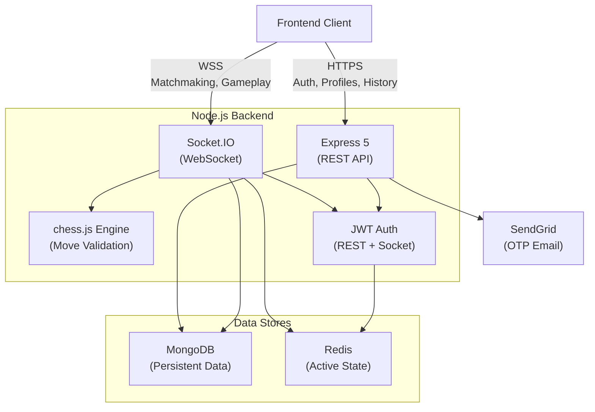
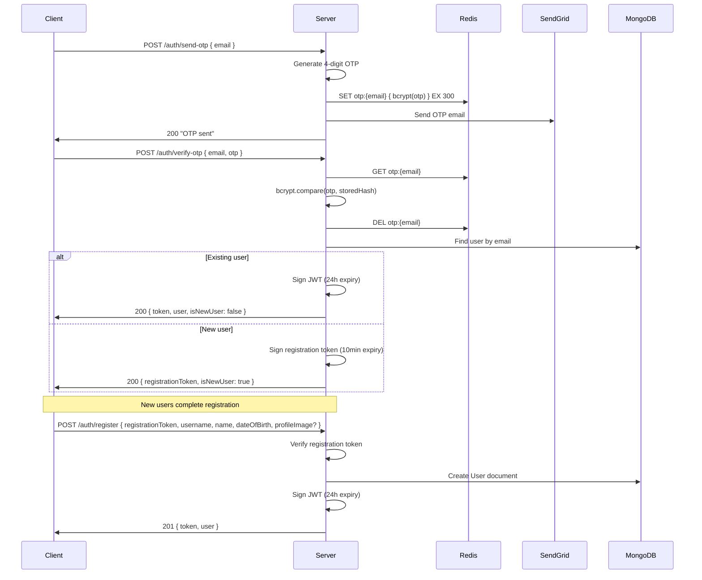
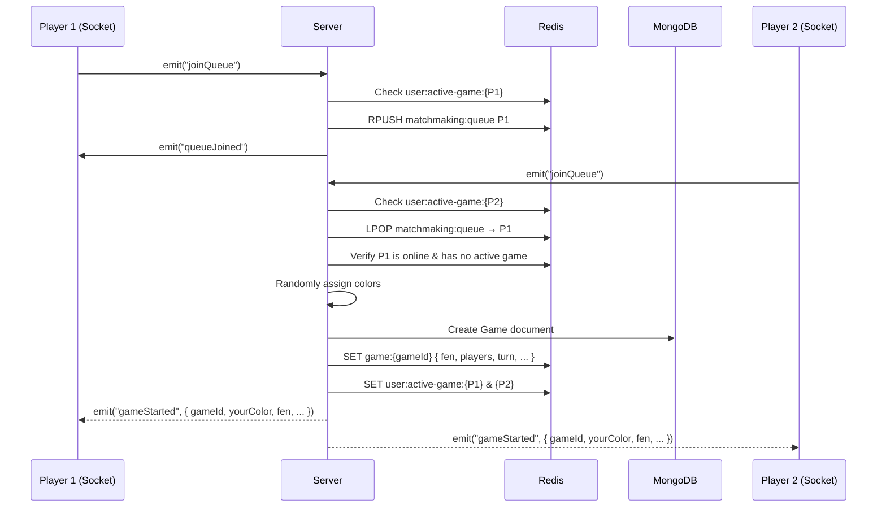
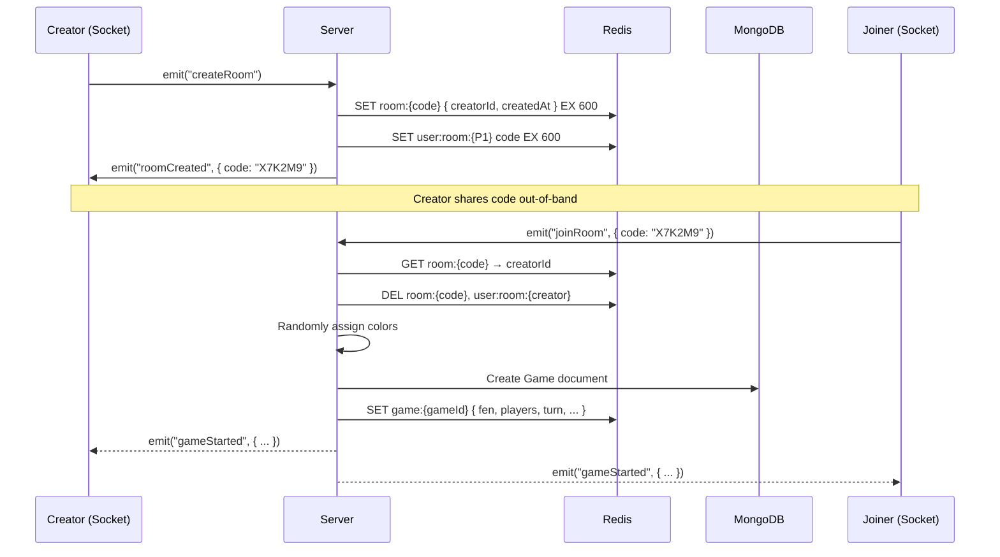
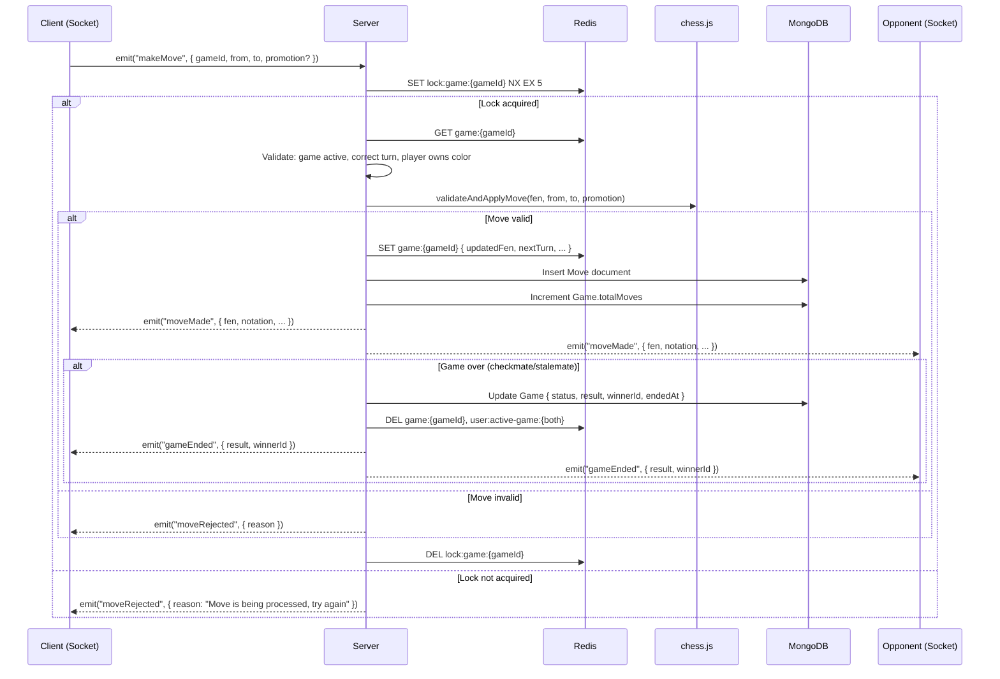
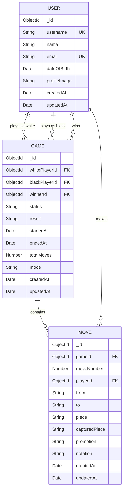
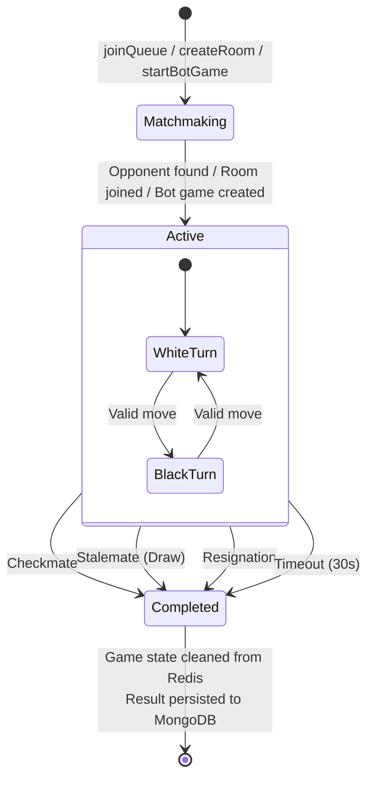
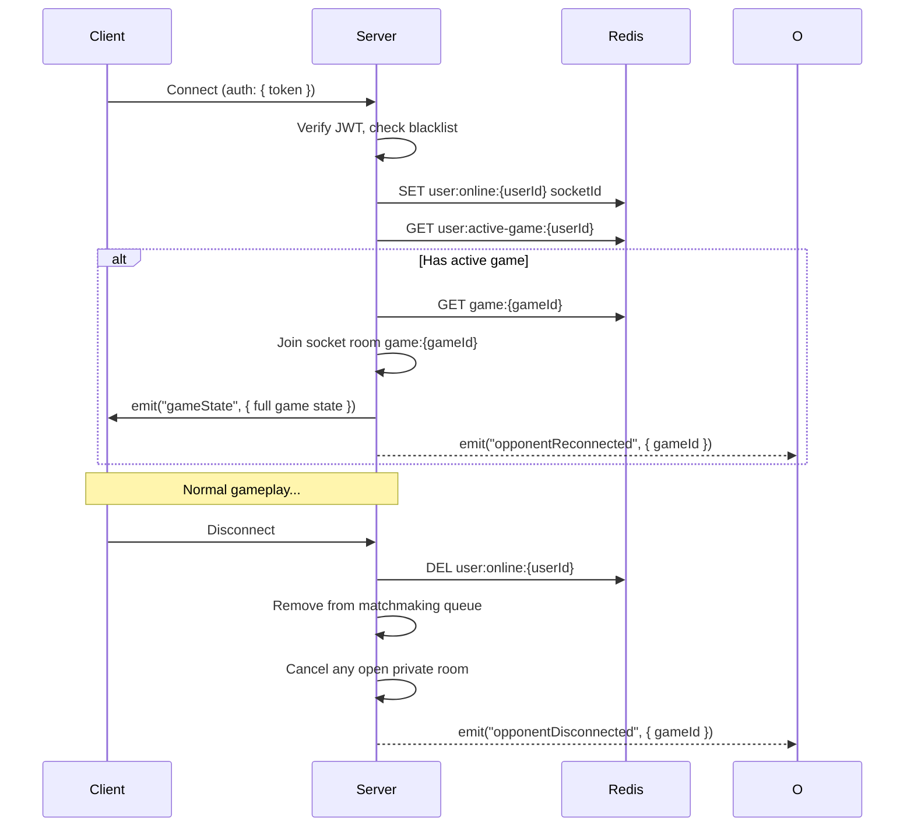
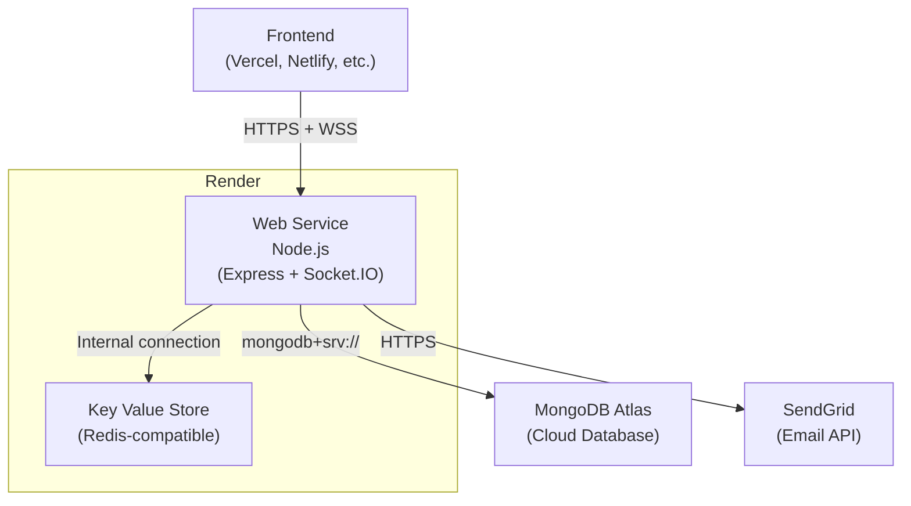

# Checkmate — Online Multiplayer Chess Backend

A real-time multiplayer chess backend built with Node.js, Express, Socket.IO, MongoDB, and Redis. Players authenticate via passwordless OTP, find opponents through random matchmaking or private room codes, and play full chess games with server-authoritative move validation, per-game concurrency locks, and persistent game history.

## Table of Contents

- [Project Overview](#project-overview)
- [Key Features](#key-features)
- [Technology Stack](#technology-stack)
- [High-Level Architecture](#high-level-architecture)
- [Backend Request & Data Flow](#backend-request--data-flow)
- [Chess Engine Design](#chess-engine-design)
- [Concurrency & Game-State Consistency](#concurrency--game-state-consistency)
- [Data Storage Design](#data-storage-design)
- [Game Lifecycle](#game-lifecycle)
- [Real-Time Architecture](#real-time-architecture)
- [API Documentation](#api-documentation)
- [Socket.IO Event Documentation](#socketio-event-documentation)
- [Authentication & Security](#authentication--security)
- [Error Handling](#error-handling)
- [Deployment](#deployment)
- [Environment Variables](#environment-variables)
- [Design Decisions & Trade-offs](#design-decisions--trade-offs)
- [What I Would Improve With More Time](#what-i-would-improve-with-more-time)
- [Testing](#testing)
- [Project Structure](#project-structure)
- [Setup & Local Development](#setup--local-development)
- [Engineering Summary](#engineering-summary)

---

## Project Overview

Checkmate is the backend for an online multiplayer chess application. It handles everything from authentication through game completion — validating every move server-side, managing active game state in Redis for low-latency reads, persisting completed games to MongoDB, and coordinating players in real time over WebSockets.

### Implemented Capabilities

| Capability | Description |
|---|---|
| Passwordless OTP Authentication | Email-based login via 4-digit OTP (SendGrid), no passwords stored |
| Random Matchmaking | FIFO Redis queue pairs players automatically |
| Private Rooms | 6-character room codes for invite-based games |
| Real-Time Multiplayer Chess | Full chess gameplay over Socket.IO with server-authoritative validation |
| Play Against Bot | Single-player mode against a bot that makes random legal moves |
| 30-Second Turn Timer | Backend-validated per-turn countdown, enforced via timestamps |
| Resignation | Either player can resign at any time |
| Checkmate & Stalemate Detection | Automatic game-end detection via chess.js |
| Game History | Paginated REST endpoints for completed games and their moves |
| Reconnection & State Sync | Automatic rejoin to active game on socket reconnect |
| User Profile Management | Username, name, date of birth, profile image upload |

---

## Key Features

### Passwordless Authentication
Users receive a 4-digit OTP via email. The OTP is bcrypt-hashed and stored in Redis with a 5-minute TTL. On verification, existing users receive a JWT; new users receive a short-lived registration token to complete signup.

### Matchmaking
- **Random queue**: Players join a Redis FIFO queue. The server pops the first waiting opponent, validates they are online and have no active game, and creates the match.
- **Private rooms**: A player creates a room (receives a 6-character code), shares it out-of-band, and the second player joins with that code. Rooms expire after 10 minutes.

### Server-Authoritative Chess
Every move submitted by a client is validated server-side using chess.js — turn order, piece ownership, legality, check exposure, promotion, castling, and en passant. The frontend is never trusted.

### Concurrency Control
A Redis-based per-game lock (`SET NX EX 5`) serializes the read-validate-update cycle for each game, preventing race conditions from simultaneous move submissions.

### Bot Mode
The bot is a seeded `User` document in MongoDB, so bot games flow through the same `Game`/`Move` schema as multiplayer games. The bot selects a uniformly random legal move. The human's move and the bot's reply are both processed within a single game lock acquisition.

### Real-Time Communication
Socket.IO handles all active gameplay: move broadcasts, game-start notifications, resignation, timeout, disconnect/reconnect signaling, and state resynchronization.

### Game History
REST endpoints serve paginated completed games with populated player details and ordered move lists.

---

## Technology Stack

| Technology | Purpose |
|---|---|
| **Node.js** (ES Modules) | Runtime. ESM throughout — `import`/`export`, no CommonJS. |
| **Express 5** | REST API framework for authentication, profiles, and game history. |
| **Socket.IO** | Bidirectional WebSocket layer for real-time gameplay and matchmaking events. |
| **MongoDB** (Mongoose) | Durable storage for users, completed games, and individual move records. |
| **Redis** (ioredis) | Active game state, OTP storage, matchmaking queue, room codes, game locks, session tracking. |
| **chess.js** | Chess rule engine — move validation, FEN management, legal move generation, game-over detection. |
| **JSON Web Tokens** | Stateless authentication for REST and Socket.IO. 24-hour expiry, blacklist on logout. |
| **bcrypt** | One-way hashing for OTPs before Redis storage. |
| **SendGrid** (`@sendgrid/mail`) | Transactional email delivery for OTP codes. |
| **Multer** | Multipart file upload handling for profile images (JPEG, PNG, WebP; 5 MB limit). |
| **Helmet** | HTTP security headers. |
| **CORS** | Cross-origin request control, configurable via `CLIENT_ORIGIN`. |
| **Winston** | Structured logging (timestamp + level + message to stdout). |
| **dotenv** | Environment variable loading from `.env` files. |

---

## High-Level Architecture



### Component Responsibilities

| Component | Responsibility |
|---|---|
| **Express** | Handles stateless operations — OTP auth, user registration, profile CRUD, game history queries. |
| **Socket.IO** | Handles stateful real-time operations — matchmaking events, move submission/broadcast, resign, timeout, reconnection. |
| **MongoDB** | Stores durable data: `User` documents, `Game` metadata (players, result, timestamps), individual `Move` records. |
| **Redis** | Stores ephemeral/fast-changing data: active game state (FEN, turn, timestamps), OTPs, matchmaking queue, room codes, game locks, online status. |
| **chess.js** | Validates every move against the current board position. Returns updated FEN, notation, captured pieces, and game-over status. |
| **JWT + bcrypt** | Authenticates REST requests (middleware) and Socket.IO connections (handshake). OTPs are hashed before storage. Tokens are blacklisted on logout. |

---

## Backend Request & Data Flow

### Authentication Flow



**Why JWT?** JWTs are stateless — the server does not need to query a session store on every request. This keeps REST endpoints fast and allows Socket.IO to authenticate during the handshake without a database round-trip. The trade-off is that revocation requires a blacklist (stored in Redis with TTL matching the token's remaining lifetime).

### Random Matchmaking Flow



The server validates that a popped opponent is still online (`user:online:{id}` exists) and has no active game. If the opponent is stale, the server continues popping until a valid match is found or the queue is empty.

### Private Room Flow



Room codes are 6-character uppercase hex strings generated via `crypto.randomBytes`. They expire after 10 minutes (configurable). A player can only have one open room at a time — creating a new room cancels the previous one. Either player or a disconnect cancels the room.

### Multiplayer Move Flow



### Bot Game Flow

1. Player emits `startBotGame`. The server creates a `Game` with `mode: "BOT"` and a Redis game state flagged with `isBotGame: true`.
2. Colors are assigned randomly. If the bot is white, the server immediately plays a random legal move (within the game lock) and emits `moveMade` before the player has moved.
3. When the player submits a move, the server validates it normally. If the game is not over after the player's move, the server immediately selects a random legal move for the bot, applies it, persists both moves to MongoDB, and emits two consecutive `moveMade` events — all within a single lock acquisition.
4. The bot is a real `User` document (`username: "checkmate_bot"`, `email: "bot@checkmate.local"`), so bot games produce the same `Game` and `Move` records as multiplayer games. Game history, move queries, and all existing code paths work unchanged.
5. The bot's move selection is a uniform random pick from `chess.js`'s legal move list — no search, no evaluation, no engine.

---

## Chess Engine Design

The chess engine is a thin wrapper (`src/engine/chessEngine.js`) around the `chess.js` library. It exposes five functions:

| Function | Purpose |
|---|---|
| `validateAndApplyMove(fen, from, to, promotion)` | Loads the FEN into a chess.js instance, attempts the move, and returns the result (new FEN, notation, piece, captured piece, check/checkmate/stalemate flags) or `{ valid: false }`. |
| `getCurrentTurn(fen)` | Returns `"w"` or `"b"` from the FEN. |
| `getGameStatus(fen)` | Returns `{ inCheck, isCheckmate, isStalemate, isGameOver, turn }`. |
| `isValidFen(fen)` | Boolean FEN validation. |
| `getLegalMoves(fen)` | Returns all legal moves as `{ from, to, promotion }` objects. Each promotion possibility (q/r/b/n) is a separate entry. Used by the bot to select a move. |
| `getStartingFen()` | Returns the standard starting position FEN. |

### What chess.js handles

- **FEN encoding**: The entire board state is a single string — position, active color, castling rights, en passant square, halfmove clock, fullmove number.
- **Legal move generation**: Accounts for pins, checks, castling legality (no castling through/out-of check, rook must not have moved), en passant timing, and pawn promotion.
- **Check, checkmate, and stalemate detection**: Checked after every move.
- **Algebraic notation**: chess.js produces SAN (Standard Algebraic Notation) for each move, stored in the `Move.notation` field.

### Why the backend validates moves even if the frontend also uses chess.js

The frontend may use chess.js for instant UI feedback (highlighting legal squares, preventing illegal drags). But the server is the authority. A malicious or buggy client could send any `{ from, to }` pair. The backend independently loads the current FEN, applies the move through chess.js, and only accepts it if chess.js confirms legality. This prevents cheating, desync, and state corruption.

---

## Concurrency & Game-State Consistency

### The Problem

Active game state lives in Redis as a JSON blob at `game:{gameId}`. Processing a move requires:

1. **Read** the current game state (GET)
2. **Validate** the move against the current FEN
3. **Write** the updated state back (SET)

This sequence is not atomic. If two requests for the same game execute concurrently (e.g., both players submit moves simultaneously, or a player double-clicks), the second read could see stale state, leading to corrupted game data or duplicate moves.

### The Solution: Per-Game Redis Locks

Before processing any move, resignation, or timeout, the handler acquires a lock:

```
SET lock:game:{gameId} "1" NX EX 5
```

- **NX** (set-if-not-exists): Only one caller acquires the lock. Others get `null` and are rejected with "Move is being processed, try again."
- **EX 5** (5-second TTL): Safety net. If the holder crashes mid-processing, the lock auto-expires rather than deadlocking the game.
- The lock is always released in a `finally` block via `DEL lock:game:{gameId}`.

### Why Per-Game, Not Global

A global lock would serialize all moves across all games. Per-game locking means games are independent — only concurrent operations on the *same* game are serialized. This is the minimum scope needed to prevent corruption.

### Bot Moves Within the Lock

In bot games, the player's move and the bot's reply are both processed within a single lock acquisition. This avoids a window where external state could change between the two moves and ensures the bot's reply is always based on the board state immediately after the player's move.

---

## Data Storage Design

### MongoDB Collections



**Why `Move` is a separate collection**: Each validated move is persisted individually as it happens, not batched at game end. This provides an append-only audit trail, enables per-move queries (e.g., move-by-move replay), and avoids unbounded array growth inside the `Game` document. The `Game` document holds only game-level metadata — it never stores board state or moves.

### Game Model Indexes

| Index | Purpose |
|---|---|
| `{ whitePlayerId: 1, status: 1 }` | Find a user's active game |
| `{ blackPlayerId: 1, status: 1 }` | Find a user's active game |
| `{ whitePlayerId: 1, endedAt: -1 }` | Game history sorted by recency |
| `{ blackPlayerId: 1, endedAt: -1 }` | Game history sorted by recency |

### Move Model Indexes

| Index | Purpose |
|---|---|
| `{ gameId: 1, moveNumber: 1 }` | Retrieve ordered moves for a game |

### Redis Key Reference

| Key Pattern | Data | TTL | Purpose |
|---|---|---|---|
| `otp:{email}` | `{ otp: bcryptHash, createdAt }` | 300s | OTP verification |
| `blacklist:{token}` | `"1"` | Token's remaining lifetime | Logout / token revocation |
| `user:online:{userId}` | Socket ID | None (deleted on disconnect) | Track connected players |
| `user:active-game:{userId}` | Game ID | None (deleted on game end) | Enforce one active game per user |
| `game:{gameId}` | JSON game state (FEN, players, turn, timestamps, moveNumber, lastMove) | None (deleted on game end) | Active game board state |
| `lock:game:{gameId}` | `"1"` | 5s | Per-game move lock |
| `matchmaking:queue` | List of user IDs | None | FIFO matchmaking queue |
| `room:{code}` | `{ creatorId, createdAt }` | 600s | Private room waiting state |
| `user:room:{userId}` | Room code | 600s | Reverse lookup for room cancellation |

### Redis Game State Structure

```json
{
  "gameId": "64f1a2b3c4d5e6f7a8b9c0d9",
  "fen": "rnbqkbnr/pppppppp/8/8/4P3/8/PPPP1PPP/RNBQKBNR b KQkq e3 0 1",
  "whitePlayerId": "64f1a2b3c4d5e6f7a8b9c0d1",
  "blackPlayerId": "64f1a2b3c4d5e6f7a8b9c0d2",
  "currentTurn": "black",
  "turnStartedAt": 1695000001000,
  "moveNumber": 2,
  "status": "ACTIVE",
  "lastMove": { "from": "e2", "to": "e4" }
}
```

Bot games additionally carry `"isBotGame": true` and `"botPlayerId"`.

---

## Game Lifecycle



### 30-Second Turn Timer

The timer is **backend-authoritative**:

1. When a turn begins (game start or after a move), the server records `turnStartedAt` (Unix milliseconds) in the Redis game state.
2. The frontend runs a local countdown for UI display and emits `moveTimeout` when it reaches zero.
3. On receiving `moveTimeout`, the server independently calculates elapsed time: `Date.now() - turnStartedAt`. If the elapsed time meets or exceeds the timeout threshold (default 30,000 ms), the game ends with result `TIMEOUT` and the opponent wins.
4. This design prevents a manipulated client from triggering a premature or delayed timeout — the server's own clock is the authority.

### Game Completion

When a game ends (by any means):
1. The `Game` document in MongoDB is updated with `status: "COMPLETED"`, `result`, `winnerId`, and `endedAt`.
2. The Redis keys `game:{gameId}`, `user:active-game:{whitePlayerId}`, and `user:active-game:{blackPlayerId}` are deleted.
3. Both players receive a `gameEnded` event with the result.

---

## Real-Time Architecture

### Socket.IO Authentication

Every socket connection authenticates during the handshake. The client passes a JWT in `socket.handshake.auth.token`. The server middleware:

1. Extracts the token.
2. Checks the Redis blacklist (`blacklist:{token}`).
3. Verifies the JWT signature and expiry.
4. Looks up the user in MongoDB.
5. Attaches `socket.user = { userId, username, email }`.

Unauthenticated connections are rejected before any event handlers are registered.

### Connection Lifecycle



### Game Rooms

When a game is created, both players' sockets join a Socket.IO room named `game:{gameId}`. All game events (`moveMade`, `gameEnded`) are broadcast to this room, ensuring both players (and only those players) receive updates.

### Why Socket.IO Instead of REST Polling

Active chess games produce frequent, low-latency state changes (moves, timer ticks, disconnect signals). Polling REST endpoints would introduce unnecessary latency, wasted bandwidth from empty polls, and complexity around long-polling timeouts. Socket.IO provides persistent bidirectional connections with automatic reconnection, room-based broadcasting, and built-in acknowledgement patterns — a natural fit for turn-based real-time gameplay.

---

## API Documentation

### Authentication

| Method | Route | Auth | Description |
|---|---|---|---|
| `POST` | `/api/v1/auth/send-otp` | No | Send a 4-digit OTP to the provided email address. |
| `POST` | `/api/v1/auth/verify-otp` | No | Verify OTP. Returns JWT (existing user) or registration token (new user). |
| `POST` | `/api/v1/auth/register` | No (registration token in body) | Complete registration with username, name, DOB, and optional profile image. Returns JWT. |
| `POST` | `/api/v1/auth/logout` | Bearer token | Blacklist the current JWT. |

### User Profile

| Method | Route | Auth | Description |
|---|---|---|---|
| `GET` | `/api/v1/users/me` | Bearer token | Retrieve the authenticated user's profile. |
| `PUT` | `/api/v1/users/me` | Bearer token | Update name and/or date of birth. |
| `PUT` | `/api/v1/users/me/profile-image` | Bearer token | Upload a new profile image (multipart/form-data, field: `profileImage`). |

### Game History

| Method | Route | Auth | Description |
|---|---|---|---|
| `GET` | `/api/v1/games?page=1&limit=10` | Bearer token | List the authenticated user's completed games (paginated, newest first). |
| `GET` | `/api/v1/games/:gameId` | Bearer token | Retrieve a single game's details and its ordered move list. Only accessible to participants. |

### Other

| Method | Route | Auth | Description |
|---|---|---|---|
| `GET` | `/health` | No | Health check. Returns `{ success: true, message: "Checkmate API is running" }`. |
| `GET` | `/uploads/:filename` | No | Serves uploaded profile images as static files. |

 ### Request & Response Examples

<details>
<summary><strong>POST /api/v1/auth/send-otp</strong></summary>

**Request:**
```json
{ "email": "player@example.com" }
```

**Response (200):**
```json
{
  "success": true,
  "statusCode": 200,
  "message": "OTP sent to your email",
  "data": null
}
```
</details>

<details>
<summary><strong>POST /api/v1/auth/verify-otp (existing user)</strong></summary>

**Request:**
```json
{ "email": "player@example.com", "otp": "4829" }
```

**Response (200):**
```json
{
  "success": true,
  "statusCode": 200,
  "message": "OTP verified",
  "data": {
    "token": "eyJhbGciOi...",
    "user": {
      "_id": "64f1a2b3c4d5e6f7a8b9c0d1",
      "username": "chessmaster",
      "name": "Alice",
      "email": "player@example.com",
      "dateOfBirth": "1995-06-15T00:00:00.000Z",
      "profileImage": null
    },
    "isNewUser": false
  }
}
```
</details>

<details>
<summary><strong>POST /api/v1/auth/register</strong></summary>

**Request** (multipart/form-data):
```
registrationToken: eyJhbGciOi...
username: chessmaster
name: Alice
dateOfBirth: 1995-06-15
profileImage: (file)
```

**Response (201):**
```json
{
  "success": true,
  "statusCode": 201,
  "message": "Registration successful",
  "data": {
    "token": "eyJhbGciOi...",
    "user": {
      "_id": "64f1a2b3c4d5e6f7a8b9c0d1",
      "username": "chessmaster",
      "name": "Alice",
      "email": "player@example.com",
      "dateOfBirth": "1995-06-15T00:00:00.000Z",
      "profileImage": "1695000000000-123456789.jpg"
    }
  }
}
```
</details>

<details>
<summary><strong>GET /api/v1/games?page=1&limit=10</strong></summary>

**Response (200):**
```json
{
  "success": true,
  "statusCode": 200,
  "message": "Games retrieved",
  "data": {
    "games": [
      {
        "_id": "64f1a2b3c4d5e6f7a8b9c0d9",
        "whitePlayerId": { "_id": "...", "username": "chessmaster", "name": "Alice", "profileImage": null },
        "blackPlayerId": { "_id": "...", "username": "rookie", "name": "Bob", "profileImage": null },
        "winnerId": { "_id": "...", "username": "chessmaster", "name": "Alice" },
        "status": "COMPLETED",
        "result": "CHECKMATE",
        "startedAt": "2024-01-15T10:30:00.000Z",
        "endedAt": "2024-01-15T10:45:00.000Z",
        "totalMoves": 42,
        "mode": "MULTIPLAYER"
      }
    ],
    "pagination": { "page": 1, "limit": 10, "total": 23, "totalPages": 3 }
  }
}
```
</details>

---

## Socket.IO Event Documentation

### Client → Server Events

| Event | Payload | Description |
|---|---|---|
| `joinQueue` | _(none)_ | Join the random matchmaking queue. |
| `leaveQueue` | _(none)_ | Leave the matchmaking queue. |
| `createRoom` | _(none)_ | Create a private room and receive a 6-character code. |
| `cancelRoom` | _(none)_ | Cancel your open private room. |
| `joinRoom` | `{ code: string }` | Join a private room by code. |
| `startBotGame` | _(none)_ | Start a single-player game against the bot. |
| `makeMove` | `{ gameId, from, to, promotion? }` | Submit a chess move. `promotion` is `"q"`, `"r"`, `"b"`, or `"n"` when promoting a pawn. |
| `resign` | `{ gameId }` | Resign from the specified game. |
| `moveTimeout` | `{ gameId }` | Signal that the opponent's turn timer has expired (server re-validates). |

### Server → Client Events

| Event | Payload | Description |
|---|---|---|
| `queueJoined` | _(none)_ | Confirmation that the player entered the queue. |
| `queueLeft` | _(none)_ | Confirmation that the player left the queue. |
| `roomCreated` | `{ code }` | Private room created; share this code with opponent. |
| `roomCancelled` | `{ code }` | Private room cancelled. |
| `gameStarted` | `{ gameId, whitePlayerId, blackPlayerId, fen, yourColor, turnStartedAt, mode?, botPlayerId? }` | A game has begun. Both players receive this. Bot games include `mode: "BOT"` and `botPlayerId`. |
| `moveMade` | `{ gameId, from, to, piece, capturedPiece, promotion, notation, fen, moveNumber, currentTurn, isCheck, turnStartedAt }` | A valid move was made. Broadcast to both players. |
| `moveRejected` | `{ gameId, reason }` | The submitted move was invalid. Sent only to the submitter. |
| `gameEnded` | `{ gameId, status, result, winnerId }` | The game is over. `result` is `CHECKMATE`, `RESIGNATION`, `TIMEOUT`, or `DRAW`. |
| `gameState` | Full game state JSON | Sent on reconnection — the full current state so the client can restore the board. |
| `opponentDisconnected` | `{ gameId }` | The opponent's socket disconnected. |
| `opponentReconnected` | `{ gameId }` | The opponent reconnected to the game. |
| `error` | `{ message }` | An error occurred processing the client's request. |

### Move Rejection Reasons

| Reason | Cause |
|---|---|
| `"Missing move data"` | `gameId`, `from`, or `to` not provided. |
| `"Move is being processed, try again"` | Another move for this game is currently being processed (lock held). |
| `"Game is not active"` | The game has already ended. |
| `"It is not your turn"` | The player attempted to move out of turn. |
| `"Illegal move"` | chess.js rejected the move (invalid piece movement, moving into check, etc.). |

---

## Authentication & Security

### Authentication Design

- **Passwordless OTP**: No passwords are stored anywhere. Users authenticate by proving email ownership via a 4-digit OTP sent through SendGrid.
- **OTP hashing**: OTPs are bcrypt-hashed before storage in Redis. Even if Redis is compromised, plaintext OTPs are not exposed.
- **OTP expiry**: 5-minute TTL in Redis. Expired OTPs are automatically purged.
- **JWT (24-hour expiry)**: Issued on successful OTP verification (existing users) or registration (new users). Carried in the `Authorization: Bearer <token>` header for REST and in `socket.handshake.auth.token` for Socket.IO.
- **Registration token**: A separate short-lived JWT (10-minute expiry, signed with a distinct secret) that authorizes a single registration attempt. This prevents a verified email from being used to register after the verification context has expired.
- **Token blacklisting**: On logout, the token is added to Redis with a TTL matching its remaining lifetime. Both REST middleware and Socket.IO auth check the blacklist before accepting a token.

### HTTP Security

- **Helmet**: Sets security-related HTTP headers (X-Content-Type-Options, X-Frame-Options, Strict-Transport-Security, etc.).
- **CORS**: Configurable via `CLIENT_ORIGIN` environment variable. Defaults to `*` for development; should be set to the frontend's exact origin in production.

### Secrets Management

All secrets (`JWT_SECRET`, `REGISTRATION_TOKEN_SECRET`, `SENDGRID_API_KEY`, database URIs) are loaded from environment variables via `dotenv`. The `.env` file is gitignored. No secrets are hardcoded or committed.

### Security Trade-offs

Authentication was intentionally kept simple for the scope of this project:

- **No refresh tokens**: The JWT has a 24-hour lifetime. When it expires, the user re-authenticates via OTP. A production system could introduce short-lived access tokens (15 minutes) with refresh-token rotation, but this adds complexity (token storage, rotation logic, revocation lists) that is not justified for the current scope.
- **No rate limiting**: OTP endpoints and Socket.IO connections are not rate-limited. A production deployment should add rate limiting (e.g., `express-rate-limit`) to prevent OTP brute-forcing and abuse.
- **Ephemeral file storage**: Profile images are stored on the local filesystem, which is acceptable for development but not for production (see [Deployment](#deployment)).

---

## Error Handling

### REST API Errors

All errors follow a consistent structure:

```json
{
  "success": false,
  "statusCode": 400,
  "message": "Human-readable error description"
}
```

Errors are thrown as `ApiError` instances with a status code and message. The global error middleware (`error.middleware.js`) catches all unhandled errors, logs the stack trace via Winston, and returns the structured response. Unknown errors default to status `500`.

### Socket.IO Errors

Socket event handlers emit an `error` event back to the client:

```json
{ "message": "You are already in an active game" }
```

Move-specific rejections use the dedicated `moveRejected` event with a `reason` field, allowing the client to distinguish between "your move was illegal" and "a transient error occurred."

### Error Categories

| Category | Examples | Communication |
|---|---|---|
| Authentication | Invalid/expired token, OTP mismatch, email required | REST 401/400 response |
| Validation | Missing fields, invalid game ID, not a participant | REST 400/403 response |
| Game state | Not your turn, game not active, illegal move | `moveRejected` socket event |
| Matchmaking | Already in game, room not found, cannot join own room | `error` socket event |
| Concurrency | Lock held by another operation | `moveRejected` with "try again" |
| Internal | Database/Redis failures | REST 500 / `error` socket event |

### Logging

All errors are logged through Winston with timestamps and severity levels. Application logs go to stdout, making them compatible with cloud platform log aggregation (Render, etc.).

---

## Deployment

The backend is configured for deployment on [Render](https://render.com) with MongoDB Atlas and a Redis-compatible key-value store.

### Production Architecture



### Render Web Service Configuration

| Setting | Value |
|---|---|
| Runtime | Node |
| Build Command | `npm install` |
| Start Command | `npm start` |
| Region | Same as Redis instance |

The server binds to `0.0.0.0` on the port provided by the `PORT` environment variable. Render provides HTTPS and WSS termination automatically — no additional TLS configuration is needed. Socket.IO WebSocket connections are supported out of the box.

### Redis Configuration

The Redis client (`src/config/redis.js`) supports two connection modes:
- **Production**: If `REDIS_URL` is set, it connects using the full URL (e.g., `redis://...` or `rediss://...`).
- **Local development**: Falls back to `REDIS_HOST`/`REDIS_PORT`/`REDIS_PASSWORD`.

### Important Production Considerations

- **File uploads**: Render's filesystem is ephemeral — uploaded profile images are lost on each deploy. For production, switch to an object store (S3, Cloudflare R2, or Render Disk).
- **Free tier cold starts**: Render free instances spin down after inactivity. Socket.IO connections will fail during spin-up (~30–50s). Use the Starter tier if persistent connections matter.
- **MongoDB network access**: Render uses dynamic IPs. Whitelist `0.0.0.0/0` in MongoDB Atlas Network Access (or use VPC peering on paid plans).

---

## Environment Variables

| Variable | Required | Default | Description |
|---|---|---|---|
| `PORT` | No | `3000` | Server port. Render sets this automatically. |
| `MONGO_URI` | Yes | — | MongoDB connection string. |
| `REDIS_URL` | Production | — | Full Redis connection URL (takes precedence over host/port/password). |
| `REDIS_HOST` | Local dev | `127.0.0.1` | Redis host (used when `REDIS_URL` is not set). |
| `REDIS_PORT` | Local dev | `6379` | Redis port. |
| `REDIS_PASSWORD` | No | — | Redis password. |
| `JWT_SECRET` | Yes | — | Secret for signing authentication JWTs. |
| `REGISTRATION_TOKEN_SECRET` | Yes | — | Separate secret for signing registration tokens. |
| `SENDGRID_API_KEY` | Yes | — | SendGrid API key for sending OTP emails. |
| `SENDGRID_FROM_EMAIL` | Yes | — | Verified sender email address for SendGrid. |
| `CLIENT_ORIGIN` | No | `*` | Allowed CORS origin. Set to frontend URL in production. |
| `OTP_TTL_SECONDS` | No | `300` | OTP expiry time in seconds. |
| `ROOM_CODE_TTL_SECONDS` | No | `600` | Private room code expiry time in seconds. |
| `TURN_TIMEOUT_MS` | No | `30000` | Per-turn time limit in milliseconds. |
| `NODE_ENV` | No | — | Set to `production` in production environments. |

**Example `.env`:**
```env
PORT=3000
MONGO_URI=<mongodb-connection-string>
REDIS_HOST=127.0.0.1
REDIS_PORT=6379
JWT_SECRET=<random-secret>
REGISTRATION_TOKEN_SECRET=<random-secret>
SENDGRID_API_KEY=<sendgrid-api-key>
SENDGRID_FROM_EMAIL=<verified-sender-email>
CLIENT_ORIGIN=http://localhost:5173
```

---

## Design Decisions & Trade-offs

### Why Redis for Active Game State?

**Problem**: Active chess games need sub-millisecond reads and writes — every move reads the board, validates, and writes back. Storing this in MongoDB would add unnecessary disk I/O and latency for data that is inherently temporary.

**Decision**: Active game state (FEN, turn, timestamps) lives in Redis. MongoDB only stores durable history (Game metadata, Move records). When a game ends, the Redis key is deleted.

**Trade-off**: If Redis loses data (crash without persistence), active games are lost. This is acceptable because games are short-lived and the alternative (dual-writing every move to MongoDB for live state) adds latency and complexity that outweighs the risk.

### Why Separate Move Documents?

**Problem**: Moves could be embedded in the Game document as an array, but that means the Game document grows with every move and must be rewritten on each update.

**Decision**: Each move is its own document with a `gameId` foreign key. Moves are appended as they happen.

**Trade-off**: Querying a game's moves requires a second query (by `gameId`), but the index on `{ gameId, moveNumber }` makes this fast. The benefit is a clean append-only pattern, no unbounded array growth, and the ability to query individual moves independently.

### Why Passwordless OTP?

**Problem**: Password-based auth requires secure storage, password reset flows, and creates friction for users.

**Decision**: Email OTP — no passwords stored, no reset flow needed. Users prove email ownership each time.

**Trade-off**: Depends on email deliverability (SendGrid). Users without email access cannot authenticate. For a chess game where sessions are relatively short, this is an acceptable simplification.

### Why chess.js on the Backend?

**Problem**: If only the frontend validates moves, a malicious client can send arbitrary moves and corrupt game state.

**Decision**: The backend independently validates every move through chess.js. The frontend's chess.js instance is purely for UI responsiveness — it has no authority.

**Trade-off**: Each move requires loading a chess.js instance from a FEN string and attempting the move. This is computationally trivial (microseconds) and eliminates an entire class of cheating vectors.

### Why Socket.IO Over REST for Gameplay?

**Problem**: Chess moves need to reach the opponent immediately. REST polling introduces latency (poll interval) and wasted requests (empty polls).

**Decision**: Socket.IO provides persistent bidirectional connections. Moves are pushed instantly to both players. Rooms scope broadcasts to game participants.

**Trade-off**: WebSocket connections consume server memory per connection. For the expected scale of this project, this is not a concern. REST is still used for stateless operations (auth, profiles, history) where request-response semantics are natural.

### Why a Random-Move Bot?

**Problem**: A bot opponent is needed for single-player practice, but integrating a chess engine (Stockfish) adds build complexity, binary dependencies, and async worker management.

**Decision**: The bot picks a uniformly random legal move from chess.js's move list. It's a real `User` document, so all existing game/move code paths work unchanged — no special-case logic in history, persistence, or move processing.

**Trade-off**: The bot is trivially weak. This is intentional for v1 — the architecture supports upgrading to a smarter strategy (minimax, Stockfish subprocess) without changing any of the game infrastructure.

### Why Per-Game Locking Over Transactions?

**Problem**: The read-validate-write cycle for moves is not atomic in Redis.

**Decision**: A `SET NX EX` lock scoped to each game serializes move processing. The 5-second TTL prevents deadlocks.

**Trade-off**: If a lock holder crashes without releasing, the game is blocked for up to 5 seconds. For a single-server deployment, this is a pragmatic choice. A distributed deployment would need a more robust locking mechanism (e.g., Redlock).

---

## What I Would Improve With More Time

### Stronger Bot Intelligence
The current bot plays random legal moves. Upgrades in order of complexity:
- **Heuristic evaluation**: Prefer captures, avoid hanging pieces, control the center.
- **Minimax with alpha-beta pruning**: Look ahead N moves with a position evaluation function.
- **Stockfish integration**: Spawn a Stockfish subprocess for engine-level play. This would require async move generation and a worker pattern to avoid blocking the event loop.

### Authentication Hardening
- **Refresh tokens**: Short-lived access tokens (15 min) with rotating refresh tokens, reducing the window of token compromise.
- **Rate limiting**: Per-IP and per-email rate limits on OTP endpoints to prevent brute-force attacks.
- **Account lockout**: Temporary lockout after repeated failed OTP attempts.

### Persistent File Storage
Replace local disk uploads with an object store (AWS S3, Cloudflare R2) so profile images survive deployments and can be served via CDN.

### Additional Chess Rules
- **Threefold repetition**: Track position history and offer/force draw.
- **Fifty-move rule**: Track halfmove clock and force draw.
- **Draw offers**: Allow players to offer and accept draws.

### Observability
- **Structured logging**: JSON log format with request IDs for log aggregation.
- **Metrics**: Track game durations, move latencies, matchmaking wait times.
- **Health checks**: Deeper health endpoints that verify MongoDB and Redis connectivity.

### Testing
- **Unit tests**: chess engine wrapper, matchmaking service, auth service.
- **Integration tests**: Full game flows — matchmaking through checkmate — against real MongoDB and Redis instances.
- **Load testing**: Simulate concurrent games to identify bottlenecks.

### Horizontal Scaling
The current architecture assumes a single server instance:
- Socket.IO would need a Redis adapter (`@socket.io/redis-adapter`) to broadcast across instances.
- The per-game lock would need a distributed lock algorithm (Redlock) to work across multiple Redis clients.
- Sticky sessions or a shared session store would be needed for WebSocket connections.

### Additional Features
- **Spectator mode**: Allow non-participants to watch live games.
- **ELO rating system**: Track player skill and match by rating.
- **Game replay**: Step through completed games move-by-move.
- **Rematch**: Allow players to start a new game immediately after completion.

---

## Testing

This project does not include automated tests. All testing was performed manually during development:

- **Authentication flow**: Verified OTP send/receive, verification, registration, login, and logout through REST client (Postman/Thunder Client).
- **Matchmaking**: Tested with multiple Socket.IO clients connecting simultaneously to verify queue behavior, room creation/joining, and edge cases (joining own room, expired rooms, already-in-game rejection).
- **Gameplay**: Played full games through Socket.IO clients to verify move validation, turn enforcement, check/checkmate/stalemate detection, resignation, and timeout.
- **Bot games**: Verified bot game creation, bot-as-white opening move, human-bot move alternation, and game completion.
- **Reconnection**: Tested by disconnecting and reconnecting mid-game to verify state resynchronization and opponent notification.
- **Edge cases**: Duplicate moves, moves on ended games, invalid promotions, concurrent move attempts.

See [What I Would Improve With More Time](#what-i-would-improve-with-more-time) for the testing strategy I would implement.

---

## Project Structure

```
src/
├── index.js                        # HTTP server entry point, binds to PORT
├── app.js                          # Express app — middleware, routes, DB connection
├── config/
│   ├── database.js                 # MongoDB connection via Mongoose
│   ├── redis.js                    # Redis client (supports URL or host/port/password)
│   └── sendgrid.js                 # SendGrid client, OTP email template
├── engine/
│   └── chessEngine.js              # chess.js wrapper — validate, apply, legal moves, FEN utils
├── middlewares/
│   ├── auth.middleware.js           # JWT verification for REST routes
│   ├── error.middleware.js          # Global Express error handler
│   └── upload.middleware.js         # Multer config — disk storage, file filter, size limit
├── modules/
│   ├── index.js                    # Route aggregator — mounts all module routes under /api/v1
│   ├── auth/
│   │   ├── auth.routes.js          # POST send-otp, verify-otp, register, logout
│   │   ├── auth.controller.js      # Request handlers for auth endpoints
│   │   ├── auth.service.js         # OTP generation/hashing, JWT signing, token verification
│   │   └── index.js
│   ├── user/
│   │   ├── user.model.js           # Mongoose schema — username, email, name, DOB, profileImage
│   │   ├── user.routes.js          # GET/PUT /me, PUT /me/profile-image
│   │   ├── user.controller.js      # Profile retrieval, update, image upload handlers
│   │   ├── user.service.js         # User CRUD operations
│   │   └── index.js
│   ├── game/
│   │   ├── game.model.js           # Mongoose schema — players, status, result, mode, timestamps
│   │   ├── game.routes.js          # GET /games (list), GET /games/:gameId (detail)
│   │   ├── game.controller.js      # History retrieval handlers
│   │   ├── game.service.js         # Game CRUD, pagination, totalMoves increment
│   │   └── index.js
│   ├── move/
│   │   ├── move.model.js           # Mongoose schema — gameId, moveNumber, from/to, piece, notation
│   │   ├── move.service.js         # Move creation, retrieval by gameId
│   │   └── index.js
│   ├── matchmaking/
│   │   ├── matchmaking.service.js  # Queue join/leave, room create/join/cancel, game creation
│   │   └── index.js
│   └── bot/
│       ├── bot.service.js          # Bot user seeding, random move selection, bot game creation
│       └── index.js
├── socket/
│   ├── index.js                    # Socket.IO server init, connection lifecycle, handler registration
│   ├── socketAuth.js               # JWT verification middleware for socket handshake
│   ├── gameLock.js                 # Redis SET NX EX lock — acquireLock / releaseLock
│   ├── gameHandler.js              # makeMove, resign, moveTimeout event handlers
│   ├── matchmakingHandler.js       # joinQueue, leaveQueue, createRoom, cancelRoom, joinRoom handlers
│   └── botHandler.js               # startBotGame handler, bot opening move logic
├── uploads/                        # Profile image storage (ephemeral in production)
└── utils/
    ├── ApiError.js                 # Error class with statusCode and message
    ├── ApiResponse.js              # Consistent success response wrapper
    ├── enums.js                    # GameStatus, GameResult, PieceColor, GameMode constants
    └── logger.js                   # Winston logger — timestamped console output
```

---

## Setup & Local Development

### Prerequisites

- **Node.js** (v18 or later)
- **MongoDB** (local instance or MongoDB Atlas)
- **Redis** (local instance or cloud provider)
- **SendGrid account** with a verified sender email

### Installation

```bash
# Clone the repository
git clone https://github.com/spandanam-tech/checkmate-API.git
cd checkmate-API

# Install dependencies
npm install
```

### Environment Setup

Create a `.env` file in the project root:

```env
PORT=3000
MONGO_URI=mongodb://localhost:27017/checkmate
REDIS_HOST=127.0.0.1
REDIS_PORT=6379
JWT_SECRET=your-jwt-secret-here
REGISTRATION_TOKEN_SECRET=your-registration-token-secret-here
SENDGRID_API_KEY=your-sendgrid-api-key
SENDGRID_FROM_EMAIL=your-verified-sender@example.com
CLIENT_ORIGIN=http://localhost:5173
```

Generate secure secrets:
```bash
node -e "console.log(require('crypto').randomBytes(32).toString('hex'))"
```

### Running the Server

```bash
# Development (auto-restart on file changes)
npm run dev

# Production
npm start
```

The server starts on the configured `PORT` (default 3000). Verify with:
```bash
curl http://localhost:3000/health
```

### Local MongoDB

```bash
# macOS (Homebrew)
brew services start mongodb-community

# Or use Docker
docker run -d -p 27017:27017 --name checkmate-mongo mongo
```

### Local Redis

```bash
# macOS (Homebrew)
brew services start redis

# Or use Docker
docker run -d -p 6379:6379 --name checkmate-redis redis
```

---

## Engineering Summary

This backend was designed around a clear separation of concerns:

- **The backend is the single source of truth for chess state.** Every move is validated server-side through chess.js. The client is never trusted.
- **Redis handles fast-changing, short-lived state** — active game boards (FEN), turn tracking, matchmaking queues, OTPs, and game locks. These are read and written on every move and discarded when no longer needed.
- **MongoDB stores durable history** — user accounts, completed game records, and individual move documents. These are written once and queried later.
- **Socket.IO handles real-time, bidirectional communication** — move broadcasts, game-start/end notifications, disconnect/reconnect signaling. REST handles stateless request-response operations where real-time push is unnecessary.
- **Per-game Redis locks prevent concurrent move corruption** without serializing unrelated games. The lock scope matches the consistency scope.
- **The bot is a regular User document**, not a special code path. Bot games produce the same Game and Move records as multiplayer games, reusing all existing persistence and history logic.
- **The architecture intentionally avoids over-engineering.** There are no message queues, no worker processes, no caching layers, and no microservices. The complexity matches what the problem actually requires — a single Node.js process that validates chess moves, manages game state in Redis, persists results to MongoDB, and pushes updates over WebSockets.
